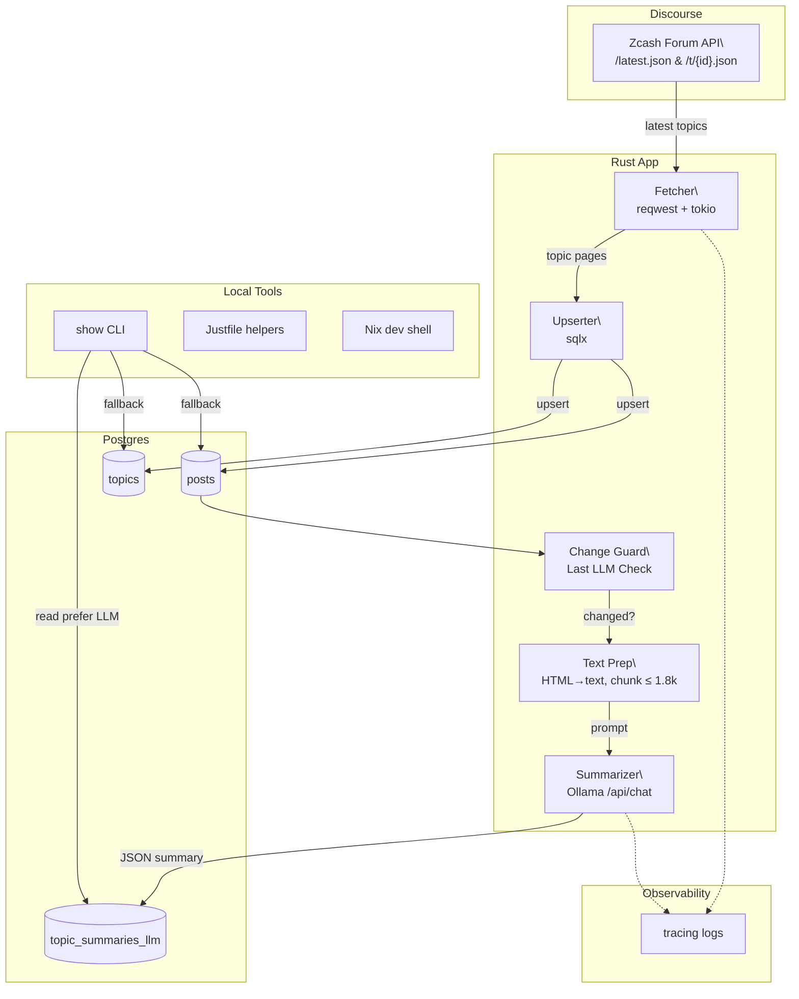

# Overview

This repo implements a local-first ETL + summarization pipeline for the Zcash Community Forum. It ingests topics/posts from Discourse, stores them in Postgres, and produces per‑topic summaries using a local LLM (Ollama + Qwen). A small CLI (show) displays the latest or searched summaries.

Note to coding agents: Please always remember to update this doc when making changes to the architecture, conventions, or components.

# Architecture

# Shared Conventions

* **Language:** Rust 1.89
* **DB:** Postgres (via sqlx), tables: topics, posts, topic_summaries_llm
* **LLM:** Ollama HTTP API /api/chat (Qwen2.5 latest or equivalent)
* **Timeouts/Backoff:** HTTP 120s total; exponential backoff for LLM calls; outer task timeout 120s
* **Chunking:** first‑page posts only (vertical slice), char‑safe chunk ≤ 1.8k
* **Summaries:** JSON → rendered into text; prefer LLM, fallback to heuristic if present

# Agents

## 1) Fetcher

**Purpose:** Pull latest topic list and first‑page posts from Discourse.

**Triggers:** On `zc-forum-etl` run.

**Inputs:**
* https://forum.zcashcommunity.com/latest.json
* https://forum.zcashcommunity.com/t/{id}.json

**Outputs:** Upserts into `topics(id, title)` and `posts(id, topic_id, username, cooked, created_at)`.

**Key env:** `DATABASE_URL`

**Failure Handling:** network errors → `error_for_status`; retries are simple (re-run process). Non‑fatal; logs via `tracing`.

**Observability:** `INFO` counts (topics fetched, posts per topic).

## 2) Change Guard
**Purpose:** Avoid redundant summarization.

**Rule:** Summarize only if `MAX(posts.created_at)` for the topic is newer than topic_summaries_llm.updated_at.

**Inputs:** `posts`, `topic_summaries_llm`

**Outputs:** boolean gate to Summarizer.

**Failure Handling:** missing rows → defaults to summarize once.

## 3) Text Prep

**Purpose:** Convert HTML (`cooked`) to space‑normalized text and build an excerpt with post IDs & timestamps.

**Logic:** regex `<[^>]*>` removal; whitespace squeeze; label lines as `[post:<id> @ <iso8601>]`.

**Limits:** ≤ 1.8k chars (char‑safe truncation).

## 4) Summarizer (Local LLM)

**Purpose:** Create concise, factual summaries with citations.

**Runtime:** Ollama → `/api/chat` with keep_alive: "5m"; model from `LLM_MODEL`
(`zc-forum-summarizer` built from `Modelfile` by default).

**Providers:** Only the local Ollama endpoint is supported; the old multi-provider `llm` module has been removed.

**Prompt:**

* System: embedded in `Modelfile` — technical note‑taker returning JSON.
* User: thread title + excerpt with `[post:<id> @ <ts>]` lines.
* Output: strict JSON `{headline, bullets[], citations[]}` stored verbatim in `topic_summaries_llm.summary`.

**Backoff/Timeout:** transport + parse errors are transient; 120s max elapsed.

**Warmup:** one tiny request before processing to force model load.

**Tokenization:** prompt and response tokens counted via `tiktoken-rs` and stored as `input_tokens`/`output_tokens`.

**Outputs → DB:** topic_summaries_llm(topic_id, summary, model, prompt_hash, input_tokens, output_tokens, updated_at).

**Failure Handling:** timeout/HTTP error → warn and continue; process remains healthy.

## 5) Storage

**Tables:**
* `topics(id BIGINT PRIMARY KEY, title TEXT)`
* `posts(id BIGINT PRIMARY KEY, topic_id BIGINT, username TEXT, cooked TEXT, created_at TIMESTAMPTZ)`
* `topic_summaries_llm(topic_id PK, summary TEXT  -- JSON {headline, bullets, citations}, model TEXT, prompt_hash TEXT, input_tokens INT, output_tokens INT, cost_usd NUMERIC, updated_at TIMESTAMPTZ)`

**Indexes:**
* `posts(topic_id, created_at)`
* `posts(topic_id, id)`
* `topic_summaries_llm(updated_at DESC)`

## 6) CLI Viewer (`show`)

**Purpose:** Inspect summaries quickly from the terminal.

**Commands:**

* `show latest [N]`
* `show id <topic_id>`
* `show search <query> [N]`

**Selection:** Prefer `topic_summaries_llm`, fallback to `topic_summaries` if present.

## 7) Dev Shell & Helpers

**Nix dev shell:** pins Rust toolchain, Postgres, `sqlx`, `just`, etc.; custom prompt indicating dev shell.

**Justfile:** `startup/pg-start/pg-stop/db-create/db-reset/test/lint/cov/summaries`.

**Exit hook:** `teardown` runs when leaving nix develop.

## 8) CI

**Purpose:** Lint and test on pushes and PRs.

**Workflow:** `.github/workflows/ci.yml` runs `cargo fmt --all -- --check`, `cargo clippy --all-features --lib -- -D warnings`, and `cargo nextest run --all-features --lib`.
It uses `Swatinem/rust-cache` to reuse Cargo registry and build artifacts across runs.

## Configuration

**Environment variables**

* `DATABASE_URL=postgres://...`
* `LLM_MODEL=qwen2.5:latest`
* `OLLAMA_BASE_URL=http://127.0.0.1:11434` (or custom port)

**Runtime knobs (Ollama options):** set in `Modelfile` (`temperature=0.2`, `num_ctx=8192`, `top_p=0.9`, `repeat_penalty=1.05`); requests use `keep_alive="5m"`.

## Failure Modes & Remedies

**404 on `/api/generate` or `/api/chat`:** wrong endpoint/port; probe /`api/version` and `/api/tags`, set `OLLAMA_BASE_URL` accordingly.

**Tokenizer error for Qwen2.5:** upgrade Ollama (older llama.cpp lacks `qwen2` pretokenizer) or use `llama3.1` temporarily.

**Transport errors on first call:** warmup request + longer timeout/backoff; pre‑pull the exact model tag.

**UTF‑8 truncation panics:** use char‑boundary truncation (implemented).

## Roadmap (near‑term)

**Pagination:** fetch all posts per topic; increase excerpt via map‑reduce.

**Map‑Reduce Summaries:** chunk summaries → merge prompt; maintain citations.

**Watermarking:** store `last_post_id` in LLM table; compare with MAX(posts.id).

**HTTP API:** expose `/latest` + `/topic/:id` JSON for external consumers.

**Caching:** persist chunk hashes (`topic_chunks`) to avoid re‑tokenizing unchanged content.

## Security & Privacy

Local inference by default (Ollama). No user secrets in prompts.

Only public forum content is processed; avoid logging raw post bodies at `INFO`.

Consider per‑provider allowlist if you later add remote LLMs.
