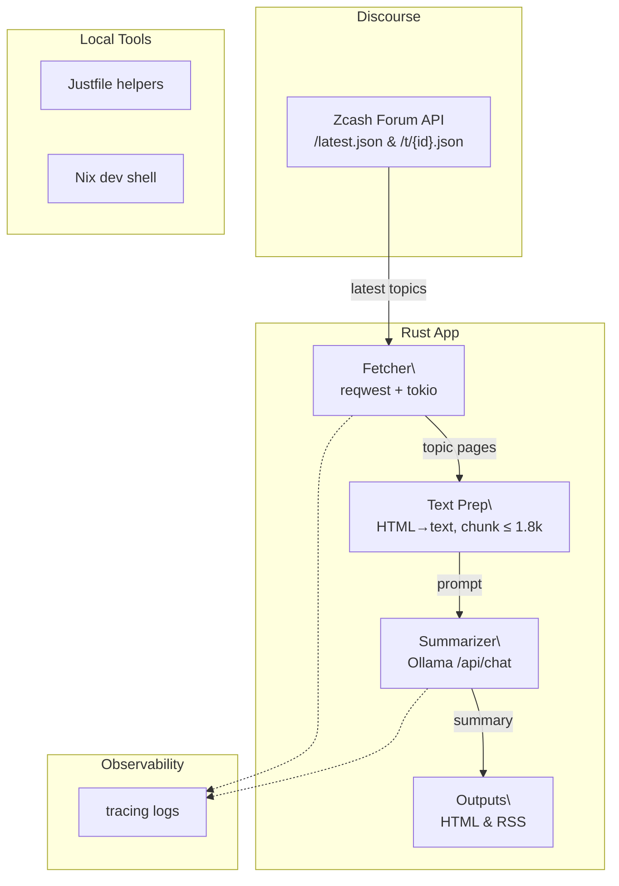

# Overview

This repo implements an in-memory summarization pipeline for the Zcash Community Forum. It ingests topics/posts from Discourse, summarizes them with a local LLM (Ollama + Qwen), and emits per-topic summaries directly to HTML and RSS outputs.

Note to coding agents: Please always remember to update this doc when making changes to the architecture, conventions, or components.

# Architecture

# Shared Conventions

* **Language:** Rust 1.89
* **LLM:** Ollama HTTP API /api/chat (Qwen2.5 latest or equivalent)
* **Timeouts/Backoff:** HTTP 120s total; exponential backoff for LLM calls; outer task timeout 120s
* **Concurrency:** topics are processed sequentially (TOPIC_CONCURRENCY = 1) to stay within GitHub Actions timeouts
* **Chunking:** first‑page posts only (vertical slice), char‑safe chunk ≤ 1.8k
* **Summaries:** LLM returns plain text only. All IDs, timestamps, authors, and URLs come directly from the forum API; links are built from IDs via `build_post_url`. Any `[post:ID]` markers echoed by the model are stripped before output.

# Agents

## 1) Fetcher

**Purpose:** Pull latest topic list and posts for each topic via pagination from Discourse.

**Triggers:** On `zc-forum-etl` run.

**Inputs:**
* https://forum.zcashcommunity.com/latest.json
* https://forum.zcashcommunity.com/t/{id}.json

**Outputs:** Posts held in memory for summarization.

**Failure Handling:** network errors → `error_for_status`; retries are simple (re-run process). Non‑fatal; logs via `tracing`.

**Observability:** `INFO` counts (topics fetched, posts per topic).

**Notes:** page requests pause for 1s to respect Discourse rate limits and stop when a page returns fewer than 20 posts or a 404.

## 2) Text Prep

**Purpose:** Convert HTML (`cooked`) to space‑normalized text and build an excerpt with post IDs & timestamps.

**Logic:** HTML parsed via `html5ever` with entity decoding and `script/style` removal;
whitespace squeeze; label lines as `[post:<id> @ <iso8601>]`.

**Limits:** ≤ 1.8k chars (char‑safe truncation). Only posts within the last 24 hours are considered; older posts are ignored.

## 3) Summarizer (Local LLM)

**Purpose:** Create concise, factual summaries.

**Runtime:** Ollama → `/api/chat` with keep_alive: "5m"; model from `LLM_MODEL`
(`zc-forum-summarizer` built from `Modelfile` by default).

**Providers:** Only the local Ollama endpoint is supported; the old multi-provider `llm` module has been removed.

**Prompt:**

* System: embedded in `Modelfile` or sent at runtime — technical note‑taker returning plain text.
* User: thread title + excerpt with `[post:<id> @ <ts>]` lines.
* Output: `- ` bullets as plain text. Any `[post:ID]` markers are stripped before rendering.

**Backoff/Timeout:** transport + parse errors are transient; 120s max elapsed.

**Warmup:** one tiny request before processing to force model load.

**Tokenization:** prompt and response tokens counted via `tiktoken-rs` using a globally cached `cl100k_base` encoder and stored as `input_tokens`/`output_tokens`.

**Outputs:** summaries are used immediately to build HTML and RSS output, then discarded.

**Failure Handling:** timeout/HTTP error → warn and continue; the process remains healthy.

## 4) Dev Shell & Helpers

**Nix dev shell:** pins Rust toolchain, `just`, and optional helpers like `ollama` and `grip`.

**Justfile:** `startup/teardown/test/lint/cov`.

**Exit hook:** `teardown` runs when leaving nix develop.

## 5) CI

**Purpose:** Lint and test on pushes and PRs.

**Workflow:** `.github/workflows/digest.yml` installs and starts Ollama, builds the `zc-forum-summarizer` model from `Modelfile`, runs the digest generator, and deploys it to GitHub Pages on a daily schedule or manual trigger.
It uses `Swatinem/rust-cache` to reuse Cargo registry and build artifacts across runs.

## Configuration

**Environment variables**

* `LLM_MODEL=qwen2.5:latest`
* `OLLAMA_BASE_URL=http://127.0.0.1:11434` (or custom port)
* `OLLAMA_MAX_ELAPSED_SECS=120` (optional retry timeout override)

**Runtime knobs (Ollama options):** set in `Modelfile` (`temperature=0.2`, `num_ctx=8192`, `top_p=0.9`, `repeat_penalty=1.05`); requests use `keep_alive="5m"`.

## Failure Modes & Remedies

**404 on `/api/generate` or `/api/chat`:** wrong endpoint/port; probe /`api/version` and `/api/tags`, set `OLLAMA_BASE_URL` accordingly.

**Tokenizer error for Qwen2.5:** upgrade Ollama (older llama.cpp lacks `qwen2` pretokenizer) or use `llama3.1` temporarily.

**Transport errors on first call:** warmup request + longer timeout/backoff; pre‑pull the exact model tag.

**UTF‑8 truncation panics:** use char‑boundary truncation (implemented).

## Roadmap (near‑term)

**Map‑Reduce Summaries:** chunk summaries → merge prompt; maintain citations.

**Watermarking:** store `last_post_id` in LLM table; compare with MAX(posts.id).

**HTTP API:** expose `/latest` + `/topic/:id` JSON for external consumers.

**Caching:** persist chunk hashes (`topic_chunks`) to avoid re‑tokenizing unchanged content.

## Security & Privacy

Local inference by default (Ollama). No user secrets in prompts.

Only public forum content is processed; avoid logging raw post bodies at `INFO`.

Consider per‑provider allowlist if you later add remote LLMs.

## 6) Daily Digest

**Purpose:** Publish an HTML and RSS digest of forum topics updated in the last 24 hours.

**Runtime:** The binary fetches recent topics, summarizes posts from the last 24 hours only, then writes `public/index.html` and `public/rss.xml` with bullet-listed summaries.

**Workflow:** `.github/workflows/digest.yml` installs and starts Ollama, builds the `zc-forum-summarizer` model from `Modelfile`, runs the digest generator, and deploys the output to GitHub Pages on a daily schedule or manual trigger.

