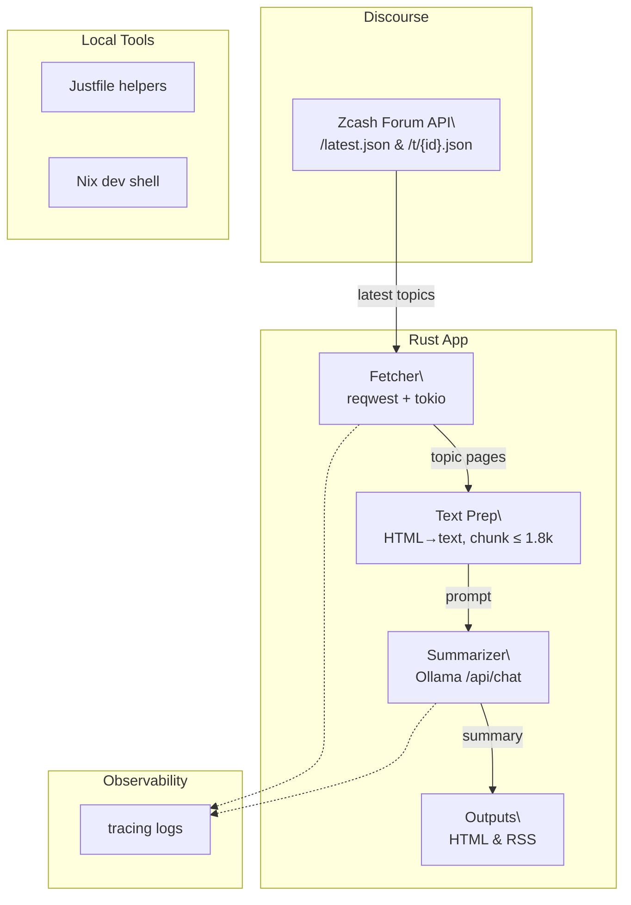

# Zcash Forum Digest _(zc-forum-etl)_

Summarization pipeline for the Zcash Community Forum. It fetches forum threads, summarizes them with a local LLM, and generates a daily HTML and RSS digest.

## Table of Contents
- [Background](#background)
- [Install](#install)
- [Usage](#usage)
  - [CLI](#cli)
- [Architecture](#architecture)
- [Configuration](#configuration)
- [Development](#development)
- [Maintainers](#maintainers)
- [Contributing](#contributing)
- [License](#license)

## Background
This project pulls discussions from the public [Zcash Community Forum](https://forum.zcashcommunity.com/),
summarizes them in memory using a local LLM (Ollama + Qwen), and writes the
results to HTML and RSS outputs.

## Install
### Dependencies
- Rust 1.89+
- [Ollama](https://ollama.com/)
- [just](https://github.com/casey/just) and [Nix](https://nixos.org/) for the dev shell (optional)

### Steps
```sh
# Clone repository
$ git clone https://github.com/aphelionz/zcash-forum-digest
$ cd zcash-forum-digest

# Enter Nix dev shell (optional but recommended)
$ nix develop

# Build the local model with the provided Modelfile
$ ollama create zc-forum-summarizer -f Modelfile
```

## Usage
Generate the digest:
```sh
$ cargo run --release
```

## Architecture


During text preparation, post HTML is parsed with a lightweight HTML5 parser
that decodes entities and removes `script`/`style` blocks before whitespace
is normalized.

## Configuration
Environment variables:
- `LLM_MODEL`: Ollama model tag (default: `qwen2.5:latest`. For tuned prompts, it is recommended to build and use `zc-forum-summarizer` from the provided `Modelfile`.)
- `OLLAMA_BASE_URL`: base URL for the Ollama API (default `http://127.0.0.1:11434`)

The ETL processes topics sequentially to avoid timeouts on GitHub Actions.
The `Modelfile` embeds the system prompt and default runtime parameters. Adjust it to tweak
`temperature`, `num_ctx`, or other options and recreate the model. Requests send only the
thread excerpt; formatting rules live in the model.

## Development
Run formatting, linting, and tests before committing:
```sh
$ cargo fmt --all -- --check
$ cargo clippy --all-features --lib -- -D warnings
$ cargo nextest run --all-features --lib
```

## Design rule

The LLM is used **only** to summarize post content. All metadata—IDs,
timestamps, authors, and titles—comes directly from the forum API and passes
through unchanged. Links are built from topic and post IDs via the
`build_post_url` helper. Any `[post:ID]` tags used in prompts are stripped from
the final summaries.

Example item:

```json
{
  "post_id": 10,
  "topic_id": 42,
  "created_at": "2024-01-01T00:00:00Z",
  "author": "carol",
  "title": "Example Topic",
  "url": "https://forum.zcashcommunity.com/t/42/10",
  "summary": "- bulleted list of key facts"
}
```

## Maintainers
- Mark Henderson <henderson.mark@gmail.com>

## Contributing
Questions, bug reports, and pull requests are welcome. Please open an
issue or submit a PR. When adding features, remember to update relevant
architecture or convention notes in `AGENTS.md`.

## License
UNLICENSED
