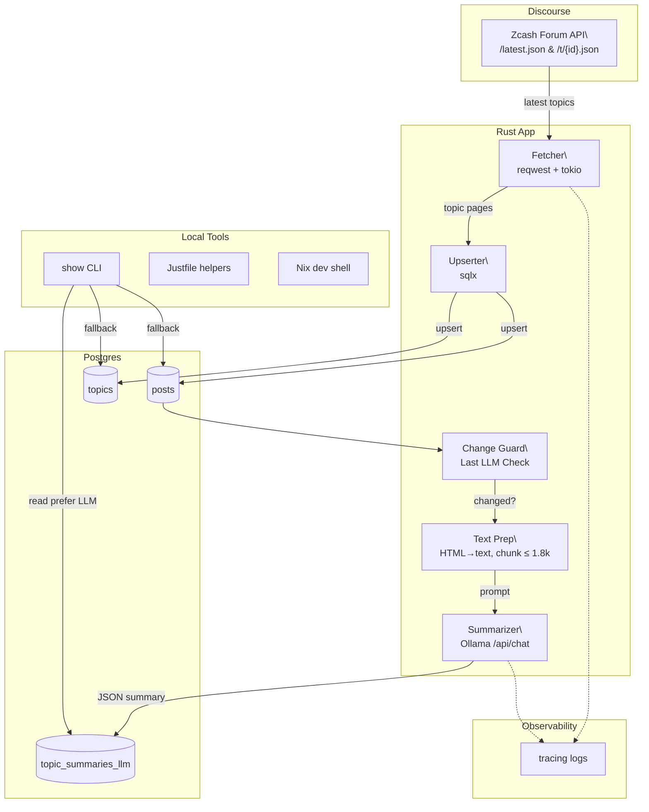

# Zcash Forum Digest _(zc-forum-etl)_

Local-first ETL and summarization pipeline for the Zcash Community Forum.

## Table of Contents
- [Background](#background)
- [Install](#install)
- [Usage](#usage)
  - [CLI](#cli)
- [Architecture](#architecture)
- [Configuration](#configuration)
- [Development](#development)
- [Maintainers](#maintainers)
- [Contributing](#contributing)
- [License](#license)

## Background
This project pulls discussions from the public [Zcash Community Forum](https://forum.zcashcommunity.com/),
stores them in Postgres, and produces concise topic summaries using a local
LLM (Ollama + Qwen). A small CLI surfaces the latest or searched summaries
for quick review.

## Install
### Dependencies
- Rust 1.89+
- Postgres
- [Ollama](https://ollama.com/) with the desired model pre-pulled (default: `qwen2.5:latest`)
- [just](https://github.com/casey/just) and [Nix](https://nixos.org/) for the dev shell (optional)

### Steps
```sh
# Clone repository
$ git clone https://github.com/.../zcash-forum-digest
$ cd zcash-forum-digest

# Enter Nix dev shell (optional but recommended)
$ nix develop

# Set up database
$ just db-create
```

## Usage
Run the ETL and summarization pipeline:
```sh
$ cargo run
```

### CLI
Inspect stored summaries from the terminal:
```sh
# Show the latest 5 summaries
$ cargo run --bin show latest 5

# Fetch a specific topic by ID
$ cargo run --bin show id 1234

# Search summaries by keyword
$ cargo run --bin show search "zcash" 5
```

## Architecture


## Configuration
Environment variables:
- `DATABASE_URL`: Postgres connection string
- `LLM_MODEL`: Ollama model tag (default `qwen2.5:latest`)
- `OLLAMA_BASE_URL`: base URL for the Ollama API (default `http://127.0.0.1:11434`)

Ollama runtime options are tuned for local inference:
`temperature=0.2`, `num_ctx=8192`, `top_p=0.9`, `repeat_penalty=1.05`, and `keep_alive="5m"`.

## Development
Run formatting, linting, and tests before committing:
```sh
$ cargo fmt --all -- --check
$ cargo clippy --all-features --lib -- -D warnings
$ cargo nextest run --all-features --lib
```

## Maintainers
- Mark Henderson <henderson.mark@gmail.com>

## Contributing
Questions, bug reports, and pull requests are welcome. Please open an
issue or submit a PR. When adding features, remember to update relevant
architecture or convention notes in `AGENTS.md`.

## License
UNLICENSED
