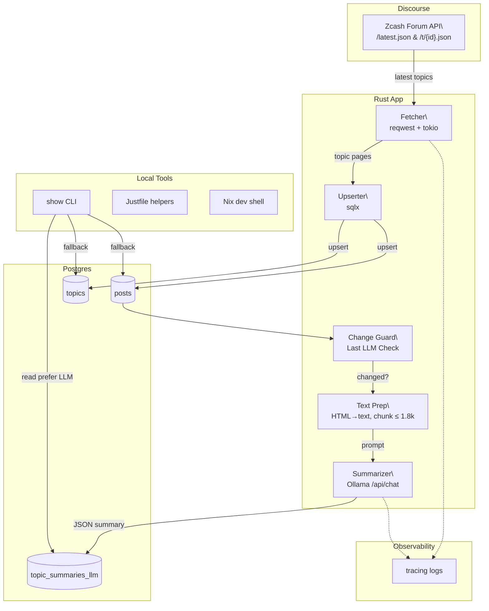

# README

# Architecture

# Architecture

```mermaid
graph TD
  subgraph Discourse
    DZC["Zcash Forum API\\n/latest.json & /t/{id}.json"]
  end

  subgraph Rust_App["Rust App"]
    F[Fetcher\\nreqwest + tokio]
    U[Upserter\\nsqlx]
    G[Change Guard\\nLast LLM Check]
    B[Text Prep\\nHTML→text, chunk ≤ 1.8k]
    S[Summarizer\\nOllama /api/chat]
  end

  subgraph Postgres
    TBL1[(topics)]
    TBL2[(posts)]
    TBL3[(topic_summaries_llm)]
  end

  subgraph Local_Tools["Local Tools"]
    CLI[show CLI]
    JUST[Justfile helpers]
    NIX[Nix dev shell]
  end

  DZC -->|latest topics| F -->|topic pages| U
  U -->|upsert| TBL1
  U -->|upsert| TBL2
  TBL2 --> G
  G -->|changed?| B
  B -->|prompt| S -->|JSON summary| TBL3
  CLI -->|read prefer LLM| TBL3
  CLI -->|fallback| TBL1
  CLI -->|fallback| TBL2

  subgraph Observability
    TR[tracing logs]
  end
  F -.-> TR
  S -.-> TR
```

